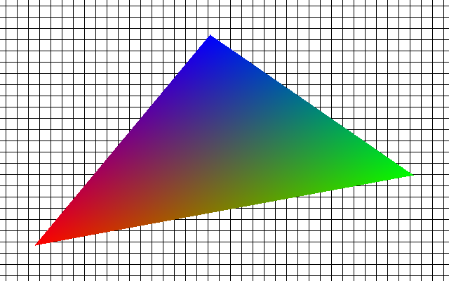

# Shading triangle - MIPS architecture

Project for Computer Architecture at WUT.
It's written in MARS (MIPS Assembler and Runtime Simulator).

## Input
- BMP file with its name, width and height.
- Three vertices with coordinates and colors.

## Output
- BMP file with the shaded triangle.

## Example

Vertices:

No. | X | Y | A | R | G | B 
--- | --- | --- | --- | --- | --- | ---
1|50 | 50|255|255|  0|  0
2|590|150|255|  0|255|  0
3|300|350|255|  0|  0|255

